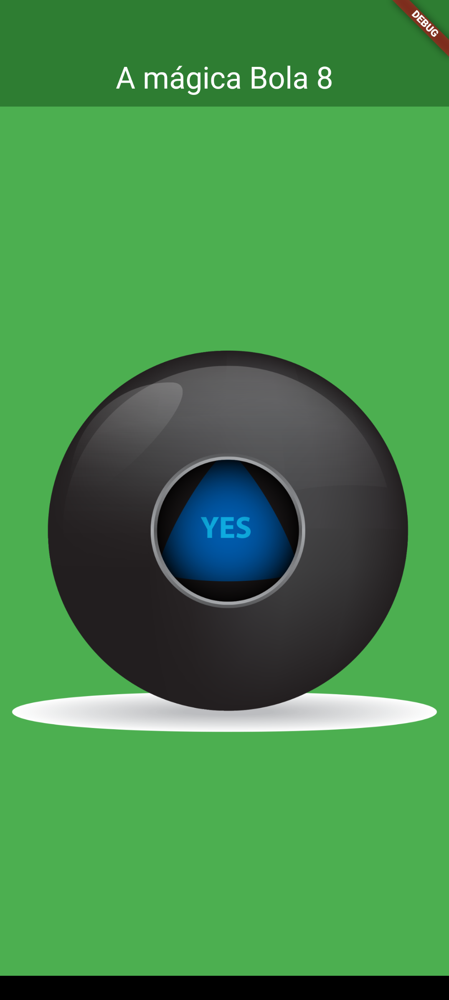

# A mágica Bola 8 - Projeto Flutter
Este projeto consiste em uma tela simples desenvolvida em Flutter, que ao usuário clicar na bola 8, as suas mensagens são trocadas.

## Capturas de tela

## Recursos e Widgets Utilizados
- **Center**: Widget utilizado para centralizar o conteúdo na tela.
- **Row**: Widget utilizado para organizar os elementos horizontalmente.
- **Expanded**: Widget utilizado para expandir o filho para preencher o espaço disponível.
- **TextButton**: Widget de botão de texto que responde ao toque do usuário.
- **CircleAvatar**: Widget utilizado para exibir uma imagem circular.
- **Image**: Widget utilizado para exibir imagens na interface do usuário.
- **Random**: Classe utilizada para gerar números aleatórios.
- **StatefulWidget**: Classe base para widgets que têm estado mutável.
- **StatelessWidget**: Classe base para widgets que têm estado imutável.

## Como Executar
1. Certifique-se de ter o ambiente de desenvolvimento Flutter configurado corretamente em seu sistema.
2. Clone este repositório.
3. Abra o projeto em seu editor de código preferido.
4. Execute `flutter pub get` para instalar as dependências.
5. Conecte um dispositivo ou inicie um emulador.
6. Execute `flutter run` para iniciar o aplicativo.

## Autor
Lucas Muner Garcia 

